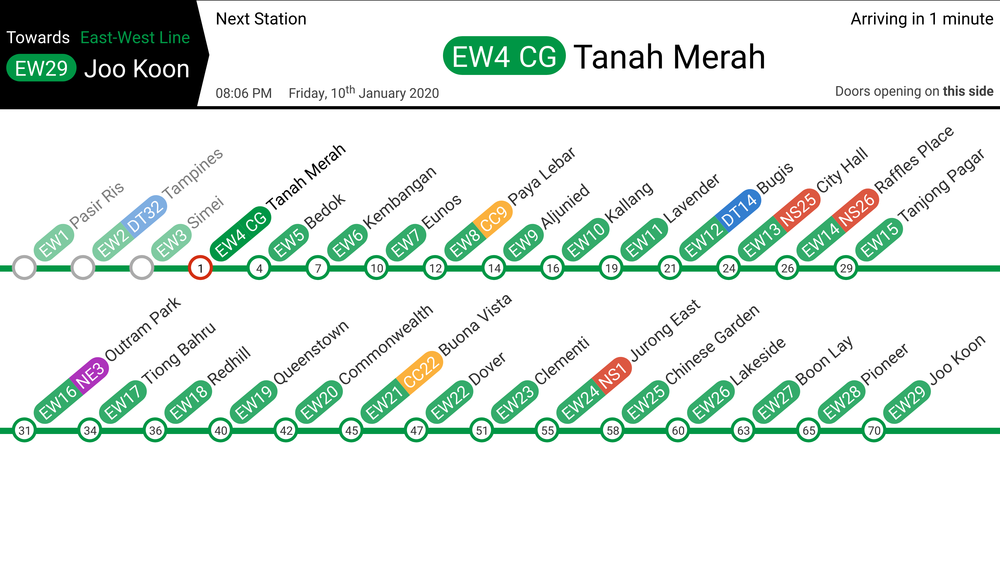

# train
This is a in-train passenger information system built on NodeJS and socket.io, using a JSON list of stations.

The default list of stations is for Singapore's East-West line.

_Unfortunately, progress has been lost._
